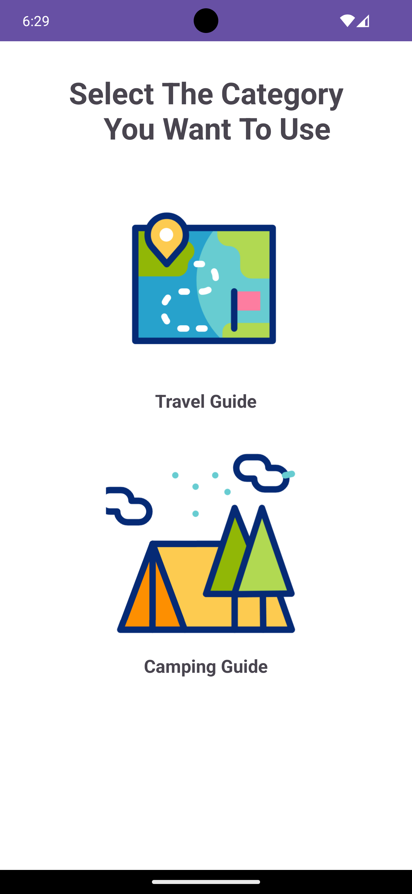
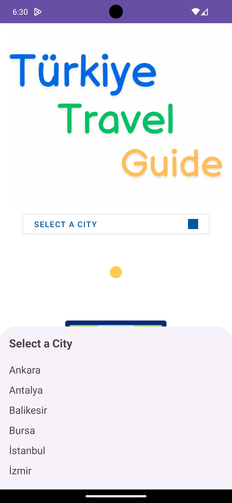
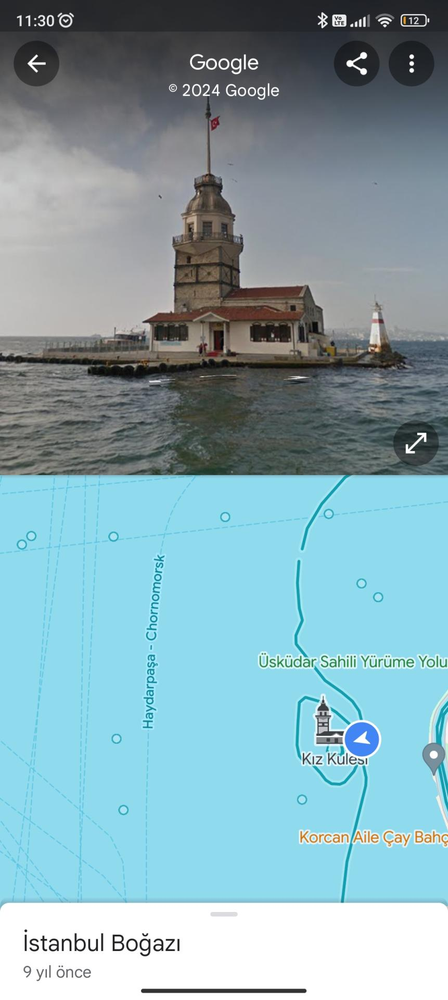
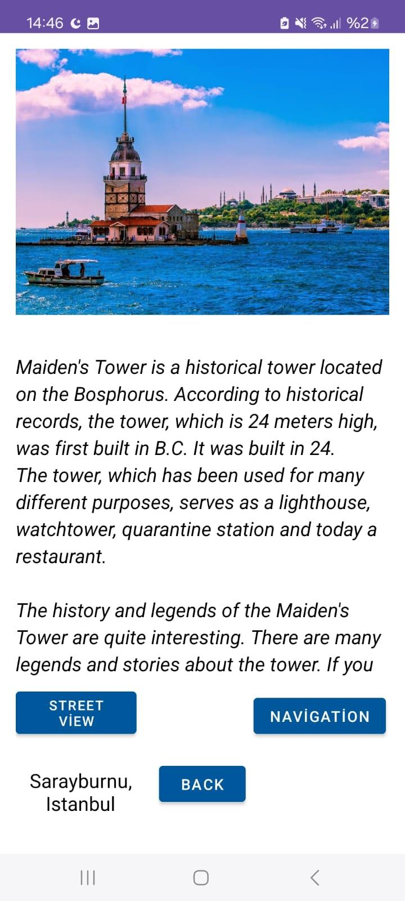
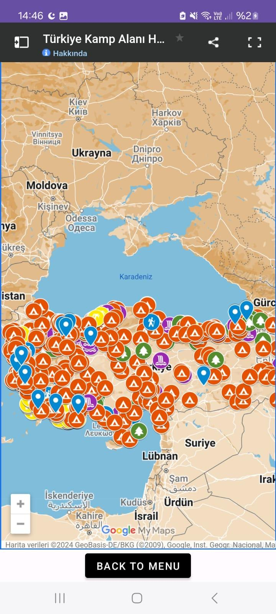
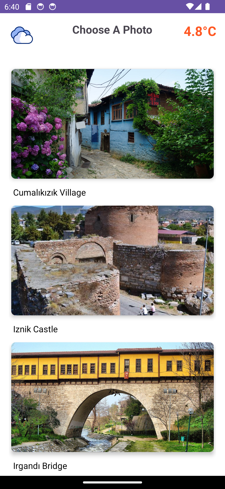
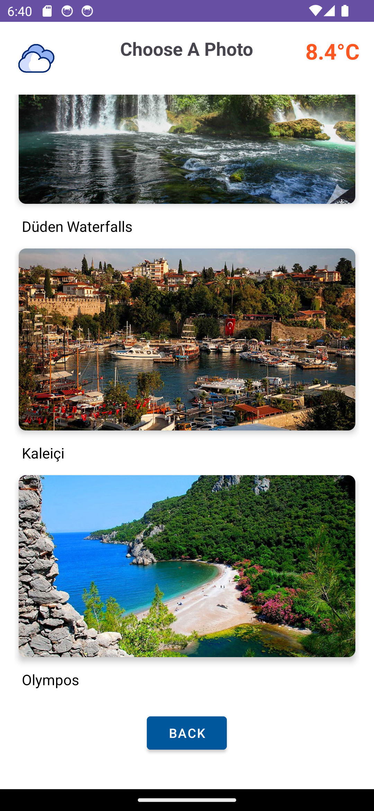
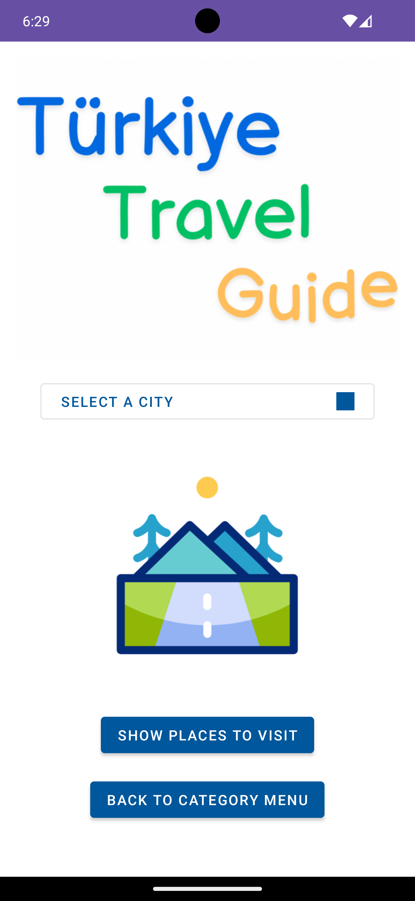

# Türkiye Travel Guide Application

## About
A comprehensive Android travel guide application that helps users explore cities in Turkey, discover landmarks, and plan their trips effectively.

## Screenshots

### Ana Ekran ve Şehir Seçimi

  
  

### Turistik Yerin 3 Boyutlu Görünümü ve Detaylar

 
 

### Kamp Haritası ve Turistik Yerler

  
  
  

### Kategori Seçimi ve Detaylar

  

## Features
### 🌟 Key Features
- Interactive city selection interface
- Real-time weather information for selected cities (4.8°C - 8.4°C as shown in app screenshots)
- Detailed information about tourist attractions
- Google Maps integration for navigation
- Street View support for immersive location preview
- Camping locations map
- Dark/Light theme support

### 🏛️ Supported Cities
- Istanbul
- Ankara
- Izmir
- Bursa
- Antalya
- Balıkesir
- And more cities throughout Türkiye

### 📍 Attractions Featured
- Historical sites like Iznik Castle
- Natural wonders like Düden Waterfalls
- Cultural spots like Cumalıkızık Village
- Scenic coastal areas like Olympos
- Harbor areas like Kaleiçi
- Architectural marvels like Irgandı Bridge
- And many more across the country

## Technical Details
### 🛠️ Built With
- Java
- Android SDK
- Google Maps API
- OpenWeather API
- WebView
- Glide for image loading
- Volley for network requests
- SharedPreferences for theme persistence

### 📱 Key Components
- `MainActivity`: Main application interface
- `CityActivity`: City-specific information display
- `PlaceDetailActivity`: Detailed view of locations
- `CampingActivity`: Camping locations interface with comprehensive map of camping sites
- `MenuActivity`: Application navigation menu

### 🔧 Dependencies
dependencies {
implementation 'com.github.bumptech.glide:glide:4.12.0'
implementation 'com.android.volley:volley:1.2.1'
implementation 'com.google.android.material:material:1.5.0'
implementation 'pl.droidsonroids.gif:android-gif-drawable:1.2.22'
}

## Setup
### Prerequisites
- Android Studio
- JDK 8 or higher
- Android SDK
- Google Maps API key
- OpenWeather API key

### Installation
1. Clone the repository:
git clone https://github.com/yahyaKocaman/Travel_Guide

2. Open project in Android Studio
3. Configure API keys in local.properties:

MAPS_API_KEY=your_google_maps_api_key
WEATHER_API_KEY=your_openweather_api_key

4. Build and run the application

## Usage
1. Launch the application
2. Select a category (Travel Guide or Camping Guide)
3. Choose a city from the dropdown menu
4. Browse through various attractions with beautiful photos
5. Use the interactive map to find camping locations throughout Türkiye
6. View weather information displayed in the top right corner
7. Access photo galleries of attractions

## Contributing
1. Fork the repository
2. Create your feature branch (`git checkout -b feature/AmazingFeature`)
3. Commit your changes (`git commit -m 'Add some AmazingFeature'`)
4. Push to the branch (`git push origin feature/AmazingFeature`)
5. Open a Pull Request

## License
This project is licensed under the MIT License - see the LICENSE file for details

## Acknowledgments
- Google Maps Platform
- OpenWeather API
- Android Development Team
- Contributors and testers

